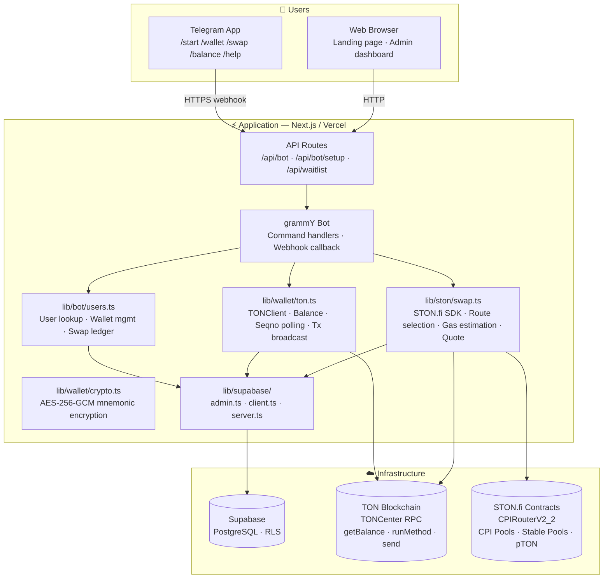
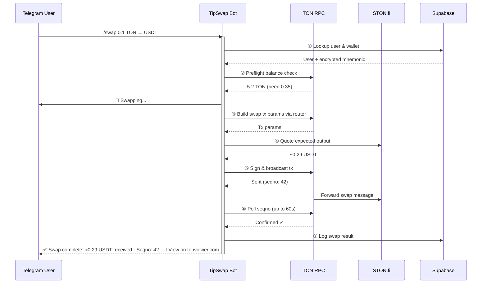
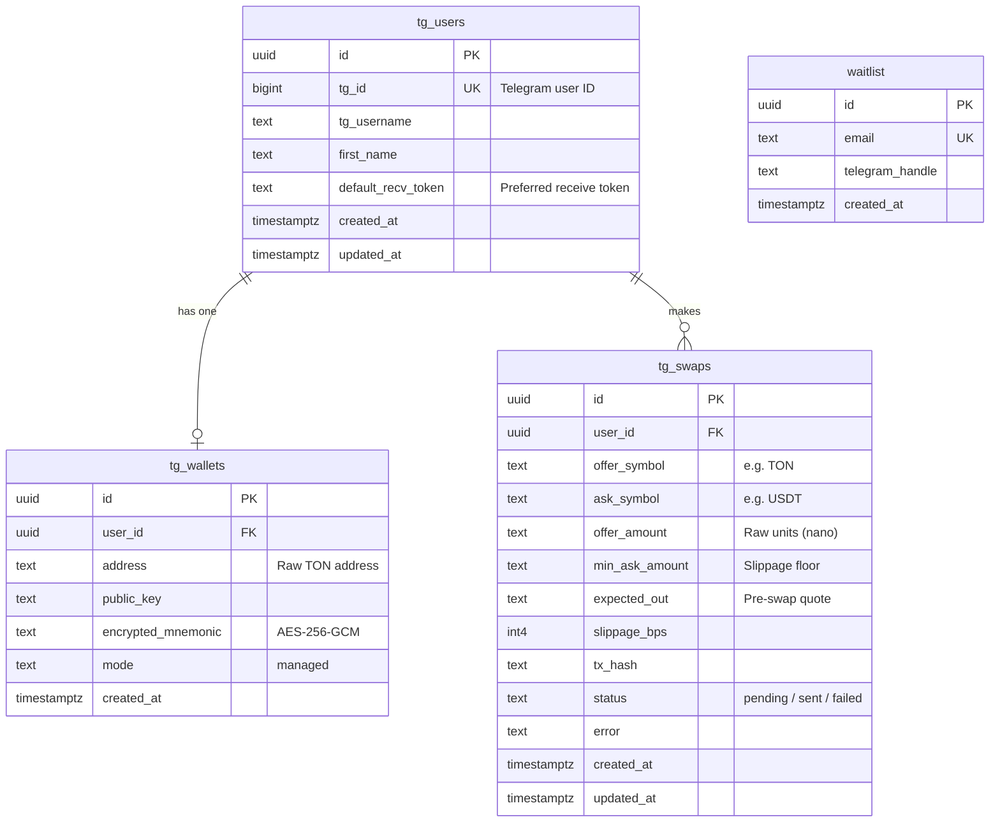
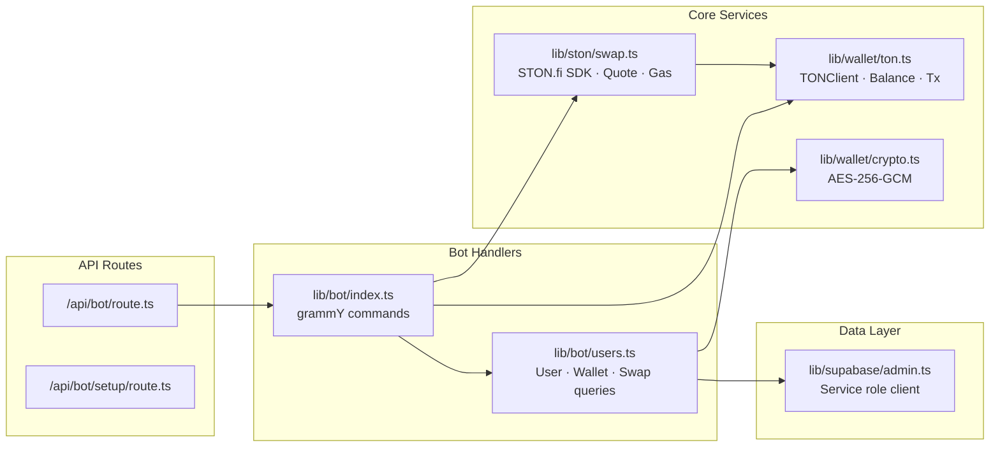

# TipSwap

**Telegram-native token tipping on TON, powered by STON.fi.**

TipSwap is a Telegram bot that lets anyone tip TON, USDT, or STON tokens to any Telegram user — even when the sender and recipient hold different tokens. The bot quotes and executes a cross-token swap on STON.fi behind the scenes, so the recipient gets the token they want without ever opening a DEX.

---

## Architecture

### System overview



### Swap lifecycle



#### Steps in detail

| Step | What happens | Code location | On failure |
|------|-------------|---------------|------------|
| ① | Look up or create `tg_user` + `tg_wallet` in Supabase | `lib/bot/users.ts` → `getOrCreateUser()` | Error returned to user |
| ② | Fetch TON balance from TONCenter; compute `cost = offerPart + gas + buffer`; compare | `lib/ston/swap.ts` → `requiredTonForSwap()` + `lib/wallet/ton.ts` → `getBalance()` | "Insufficient TON balance" with component breakdown |
| ③ | Call the relevant `getSwap*TxParams` on CPIRouterV2_2 (TON→Jetton, Jetton→TON, or Jetton→Jetton) | `lib/ston/swap.ts` → `executeSwap()` | "Swap route unavailable" or specific DEX error |
| ④ | Open the pool via `router.getPool()`, read `reserve0`/`reserve1`, compute CPF formula with on-chain fees | `lib/ston/swap.ts` → `getExpectedOut()` | Omitted silently — swap still proceeds |
| ⑤ | Derive keypair from mnemonic, create `WalletContractV4`, build transfer with `PAY_GAS_SEPARATELY + IGNORE_ERRORS`, send via `TonClient` | `lib/wallet/ton.ts` → `sendInternalMessage()` | Mapped to user-friendly error |
| ⑥ | Poll `getSeqno()` with 2s intervals until seqno advances or timeout hits 60s | `lib/wallet/ton.ts` → `sendInternalMessage()` polling loop | Status = "sent" or "failed" |
| ⑦ | Update `tg_swaps.status` + `error` in Supabase | `lib/bot/users.ts` → `updateSwapStatus()` | Logged server-side only |

### Gas cost reference

| Swap path | Gas | Buffer | Swap amount (if TON offer) | Total needed |
|-----------|-----|--------|---------------------------|--------------|
| TON → Jetton | 0.2 TON | 0.05 TON | Yes | 0.25 TON + offer amount |
| Jetton → TON | 0.2 TON | 0.05 TON | No | 0.25 TON |
| Jetton → Jetton | 0.3 TON | 0.05 TON | No | 0.35 TON |

### Data model



### Module dependencies



### Key architectural decisions

- **All bot code is server-only** (`"server-only"` import directive) — never shipped to the browser, never accidentally exposed
- **Three Supabase clients** — `admin.ts` (service role, bot/setup APIs), `client.ts` (anonymous, SSG/CSR), `server.ts` (authenticated, RSC)
- **Single Bot instance** — lazily instantiated via `getBot()`; webhook handler passes request to grammY's `webhookCallback()`
- **Stateless command handlers** — every request fetches fresh state from Supabase + TON RPC; no in-memory session
- **Best-effort quoting** — on-chain price estimation before broadcast; failure to quote never blocks the swap
- **Exponential backoff** on TONCenter 429s — 5 retries with 2× delay starting at 600ms

---

## Stack

| Layer | Technology |
|---|---|
| App framework | [Next.js 16](https://nextjs.org) (App Router) |
| Runtime | Node.js |
| UI | React 19, [Tailwind CSS v4](https://tailwindcss.com), [framer-motion](https://motion.dev) |
| Telegram bot | [grammY](https://grammy.dev) |
| TON blockchain | [`@ton/ton`](https://www.npmjs.com/package/@ton/ton), [`@ton/core`](https://www.npmjs.com/package/@ton/core) |
| DEX integration | [`@ston-fi/sdk`](https://www.npmjs.com/package/@ston-fi/sdk) |
| Database | Supabase (PostgreSQL) |
| Wallet model | Managed TON v4 wallets, AES-256-GCM encrypted mnemonics |

---

## Project layout

```
app/
  page.tsx                     Landing page
  admin/setup/page.tsx         Webhook management UI
  api/
    bot/route.ts               Telegram webhook receiver
    bot/setup/route.ts         Webhook setup/inspection API
    waitlist/route.ts          Public waitlist signup

components/
  site/                        Marketing sections (hero, features, waitlist)
  ui/                          Shared Radix UI primitives

lib/
  bot/
    index.ts                   grammY command handlers
    users.ts                   Supabase helpers for users, wallets, swaps
  ston/
    swap.ts                    STON.fi swap construction, quote preflight, gas estimation
  supabase/
    admin.ts                   Server-side admin client (service role)
    client.ts                  Browser client
    server.ts                  Server component client
    types.ts                   Generated type definitions
  wallet/
    ton.ts                     TON client, wallet generation, balance, broadcast
    crypto.ts                  AES-256-GCM mnemonic encryption/decryption

scripts/
  001_init_schema.sql          Database migration
```

---

## Bot commands

| Command | Description |
|---|---|
| `/start` | Register or restore your managed wallet |
| `/wallet` | Show wallet address and TON balance |
| `/balance` | Show TON, USDT, and STON balances |
| `/swap <amount> <from> <to>` | Execute a cross-token swap |
| `/help` | Full command reference |

**Supported tokens:** `TON`, `USDT`, `STON`

**Example:**
```
/swap 0.1 TON USDT
```
The bot checks the balance, estimates gas, queries the pool for a quote, executes the swap on STON.fi, and confirms with an on-chain transaction link.

---

## Database

The schema lives in `scripts/001_init_schema.sql`. Four tables, all with RLS enabled:

| Table | Purpose | Access |
|---|---|---|
| `waitlist` | Public landing page signups | Anonymous inserts allowed |
| `tg_users` | Telegram user records, keyed by `tg_id` | Service role only |
| `tg_wallets` | Managed wallets (encrypted mnemonics) per user | Service role only |
| `tg_swaps` | Swap attempt ledger with status and error history | Service role only |

A `touch_updated_at()` trigger maintains `updated_at` on `tg_users` and `tg_swaps`.

---

## Environment variables

### Required

| Variable | Purpose |
|---|---|
| `TELEGRAM_BOT_TOKEN` | Bot token from [@BotFather](https://t.me/BotFather) |
| `TELEGRAM_WEBHOOK_SECRET` | Secret token validated on incoming webhook requests |
| `ADMIN_SETUP_TOKEN` | Bearer token for webhook setup API access (production) |
| `WALLET_ENCRYPTION_KEY` | Symmetric key for AES-256-GCM mnemonic encryption (min 32 chars) |
| `STON_NETWORK` | Must be `mainnet` |
| `NEXT_PUBLIC_SUPABASE_URL` | Public Supabase project URL |
| `NEXT_PUBLIC_SUPABASE_ANON_KEY` | Public Supabase anon key |

### Server-side Supabase

The admin client accepts either of:
- `SUPABASE_SERVICE_ROLE_KEY`
- `SUPABASE_SECRET_KEY`

It also accepts `SUPABASE_URL`, falling back to `NEXT_PUBLIC_SUPABASE_URL`.

### Optional

| Variable | Purpose |
|---|---|
| `TON_API_KEY` | TONCenter API key for higher rate limits and more reliable swap execution |

---

## Local development

**Requirements:** Node.js 20+, `pnpm`

```bash
# Install dependencies
pnpm install

# Start the dev server
pnpm dev
```

Open [http://localhost:3000](http://localhost:3000).

### Testing the bot locally

Telegram requires a public HTTPS webhook URL. Use a tunnel:

```bash
ngrok http 3000
```

Then register the webhook via the admin dashboard at `/admin/setup` or directly through the setup API. The public URL will be pre-filled — just paste your `ADMIN_SETUP_TOKEN` and click **Set webhook**.

---

## Deployment

### Vercel

1. Configure all required environment variables in the Vercel dashboard
2. Ensure `STON_NETWORK=mainnet`
3. Add `TON_API_KEY` to avoid TONCenter throttling
4. Deploy from `main`
5. Register the Telegram webhook against your production domain

### Telegram webhook

The webhook endpoint:

```
POST /api/bot
```

The setup/inspection API (admin-token protected in production):

```
GET|POST /api/bot/setup
```

The webhook handler validates the `X-Telegram-Bot-Api-Secret-Token` header on every request. Requests without the correct secret receive a `403` response.

---

## Security

- Wallet mnemonics are encrypted at rest with AES-256-GCM and scrypt-derived keys before being stored in Supabase
- All database operations for bot data use a service-role client that bypasses RLS — this client is never exposed to the browser
- Webhook requests are verified with a shared secret token
- The webhook setup API requires `Authorization: Bearer <ADMIN_SETUP_TOKEN>` in production
- RLS is enabled on all database tables; public access is limited to the `waitlist` table

---

## Operational notes

### Error handling

- TON balance preflight runs before every swap to prevent gas-out failures
- TONCenter HTTP 429 responses trigger exponential backoff (up to 5 retries)
- RPC 500 errors produce user-friendly messages instead of raw tracebacks
- Swap route failures are surfaced clearly with recovery suggestions

### Hot wallet model

The bot uses managed per-user wallets. This is convenient for onboarding but carries operational risk. Production deployments should add:
- Per-user balance and volume limits
- Wallet export / self-custody graduation
- Rate limiting on commands
- Monitoring and alerting

### Slippage

Current swap execution stores the `slippageBps` parameter but defaults to a permissive `minAskAmount` of 1 raw unit. Production deployments should compute the minimum output from a real-time pool quote before broadcasting.

---

## Scripts

| Command | Description |
|---|---|
| `pnpm dev` | Start the local dev server |
| `pnpm build` | Production build |
| `pnpm start` | Start the production server |
| `pnpm lint` | Run ESLint |
| `pnpm typecheck` | TypeScript type checking |
| `pnpm verify` | Typecheck + lint + build (CI) |

---

## License

MIT
