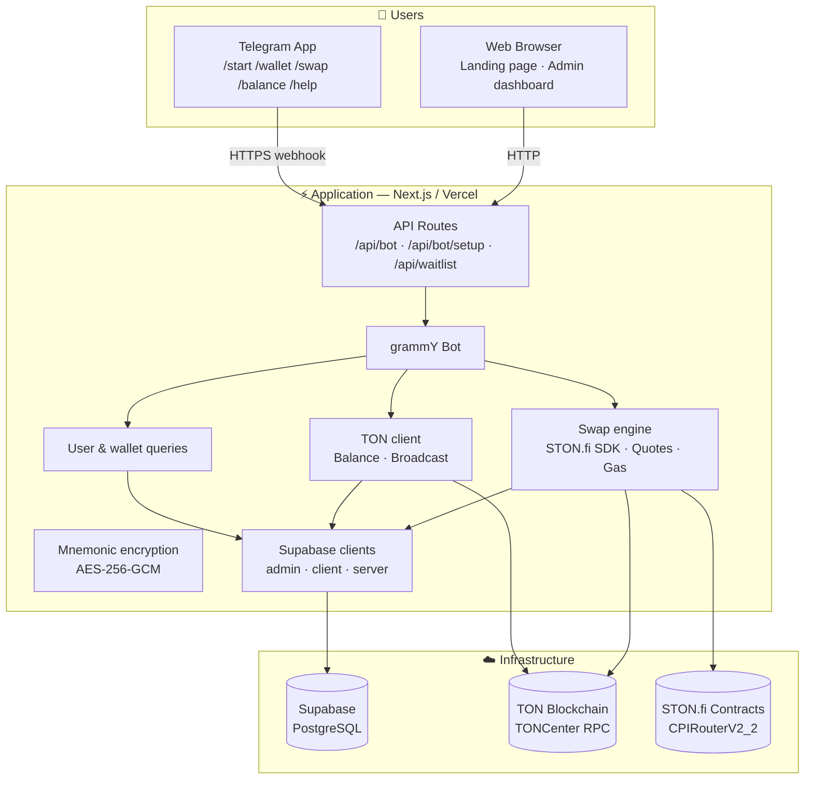

# TipSwap

**Telegram-native token tipping on TON, powered by STON.fi.**

TipSwap is a Telegram bot that lets anyone tip TON, USDT, or STON tokens to any Telegram user — even when the sender and recipient hold different tokens. The bot swaps across tokens on STON.fi behind the scenes, so the recipient gets what they want without ever opening a DEX.

---

## Architecture



**How a swap works:**

1. A user sends `/swap 0.1 TON USDT` to the Telegram bot
2. The bot looks up the user's managed wallet in Supabase and decrypts the mnemonic
3. It checks the TON balance to ensure there's enough for gas (0.2–0.35 TON depending on the route)
4. It builds the swap transaction via STON.fi's CPIRouterV2_2 contract
5. It quotes the expected output from the pool reserves (best-effort — if it fails, the swap still proceeds)
6. It signs and broadcasts the transaction, then polls for confirmation (up to 60s)
7. It logs the result in Supabase and sends the user a confirmation with a tonviewer link

**Key design decisions:**

- **Server-only bot code** — the grammY handlers use a `"server-only"` import and are never exposed to the browser
- **Three Supabase clients** — service role for bot/API routes, anonymous for the landing page, authenticated for Next.js server components
- **Stateless handlers** — every request fetches fresh state from Supabase and TON RPC; no in-memory session
- **Best-effort quoting** — the on-chain price estimate is informative only; a quote failure never blocks a swap
- **Exponential backoff** — TONCenter 429 responses trigger up to 5 retries with 2× delay starting at 600ms

**Database:** Four tables (`tg_users`, `tg_wallets`, `tg_swaps`, `waitlist`) with RLS enabled. Only `waitlist` allows anonymous inserts — all bot data is service-role only. Wallet mnemonics are encrypted at rest with AES-256-GCM.

---

## Stack

| Layer | Technology |
|---|---|
| App framework | [Next.js 16](https://nextjs.org) (App Router) |
| Runtime | Node.js |
| UI | React 19, [Tailwind CSS v4](https://tailwindcss.com), [framer-motion](https://motion.dev) |
| Telegram bot | [grammY](https://grammy.dev) |
| TON blockchain | [`@ton/ton`](https://www.npmjs.com/package/@ton/ton), [`@ton/core`](https://www.npmjs.com/package/@ton/core) |
| DEX integration | [`@ston-fi/sdk`](https://www.npmjs.com/package/@ston-fi/sdk) |
| Database | Supabase (PostgreSQL) |

---

## Bot commands

| Command | Description |
|---|---|
| `/start` | Register or restore your managed wallet |
| `/wallet` | Show wallet address and TON balance |
| `/balance` | Show TON, USDT, and STON balances |
| `/swap <amount> <from> <to>` | Execute a cross-token swap |
| `/help` | Full command reference |

**Supported tokens:** `TON`, `USDT`, `STON`

---

## Project layout

```
app/
  page.tsx                Landing page
  admin/setup/            Webhook management UI
  api/bot/route.ts        Telegram webhook receiver
  api/bot/setup/route.ts  Webhook setup/inspection API
  api/waitlist/route.ts   Public waitlist signup

lib/
  bot/
    index.ts              grammY command handlers
    users.ts              Supabase helpers for users, wallets, swaps
  ston/swap.ts            STON.fi swap construction, quotes, gas estimation
  supabase/               Three clients + generated types
  wallet/
    ton.ts                TON client, wallet gen, balance, broadcast
    crypto.ts             AES-256-GCM mnemonic encryption

components/site/          Landing page sections
components/ui/            Shared Radix UI primitives
scripts/                  001_init_schema.sql
```

---

## Getting started

**Requirements:** Node.js 20+, `pnpm`

```bash
pnpm install
pnpm dev
```

Open [http://localhost:3000](http://localhost:3000).

To test the bot locally, you need a public HTTPS URL:

```bash
ngrok http 3000
```

Then go to `/admin/setup`, paste your `ADMIN_SETUP_TOKEN`, and click **Set webhook**.

---

## Environment variables

| Variable | Purpose |
|---|---|
| `TELEGRAM_BOT_TOKEN` | Bot token from [@BotFather](https://t.me/BotFather) |
| `TELEGRAM_WEBHOOK_SECRET` | Secret token validated on webhook requests |
| `ADMIN_SETUP_TOKEN` | Bearer token for webhook setup API (production) |
| `WALLET_ENCRYPTION_KEY` | Symmetric key for mnemonic encryption (min 32 chars) |
| `STON_NETWORK` | Must be `mainnet` |
| `NEXT_PUBLIC_SUPABASE_URL` | Supabase project URL |
| `NEXT_PUBLIC_SUPABASE_ANON_KEY` | Supabase anon key |

The admin Supabase client also accepts `SUPABASE_SERVICE_ROLE_KEY` or `SUPABASE_SECRET_KEY`, and falls back `SUPABASE_URL` → `NEXT_PUBLIC_SUPABASE_URL`.

**Optional:** `TON_API_KEY` — TONCenter API key for higher rate limits.

---

## Deployment

Deploy to Vercel with all environment variables configured. Make sure `STON_NETWORK=mainnet`.

After deployment, set the webhook:

```
POST /api/bot
```

The setup/inspection API (`GET|POST /api/bot/setup`) requires `Authorization: Bearer <ADMIN_SETUP_TOKEN>` in production. Every webhook request validates `X-Telegram-Bot-Api-Secret-Token` — requests without it get a `403`.

---

## Operational notes

- **Error handling:** Balance preflight prevents gas-out failures. TONCenter 429s trigger exponential backoff. RPC errors produce user-friendly messages.
- **Hot wallet model:** Per-user managed wallets are convenient but carry risk. Production deployments should add per-user limits, wallet graduation, command rate limiting, and monitoring.
- **Slippage:** Currently defaults to a permissive `minAskAmount` of 1 raw unit. Production deployments should compute the minimum output from a real-time pool quote before broadcasting.

---

## Scripts

| Command | Description |
|---|---|
| `pnpm dev` | Start the dev server |
| `pnpm build` | Production build |
| `pnpm start` | Start the production server |
| `pnpm lint` | Run ESLint |
| `pnpm typecheck` | TypeScript type checking |
| `pnpm verify` | Typecheck + lint + build (CI) |

---

## License

MIT
