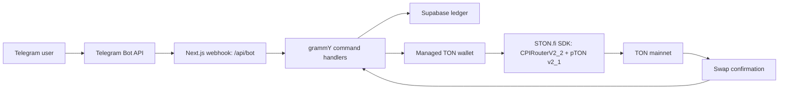

# TipSwap x STON.fi Meeting Brief

Prepared for the STON.fi team. Status date: 2026-05-16.

## One-liner

TipSwap is a Telegram-native tipping bot for TON ecosystem tokens. A user tips from chat, TipSwap resolves the wallet flow, and STON.fi handles the cross-token swap behind the scenes so the recipient receives their preferred token without opening a DEX.

## Why STON.fi Should Care

Telegram is the natural social layer for TON. The hard part in onchain tipping is not intent; it is friction: token mismatch, gas, wallet setup, and the mental overhead of "swap, then send." TipSwap collapses that into one chat action.

For STON.fi, TipSwap is a distribution surface:

- every supported cross-token tip becomes STON.fi-routed swap volume
- every Telegram group that adds the bot becomes a STON.fi acquisition channel
- managed onboarding creates new TON wallets that can later graduate into self-custody
- group/reaction tipping turns swaps into social behavior instead of isolated trading sessions

## Current Verified Foundation

The repo currently represents a Milestone 1 foundation rather than the full tipping product.

Verified working in code and smoke tests:

- Next.js 16 App Router app builds in production mode
- Telegram webhook endpoint exists at `/api/bot`
- webhook POST validates `X-Telegram-Bot-Api-Secret-Token`
- grammY bot commands: `/start`, `/help`, `/wallet`, `/swap`
- managed TON v4 wallet generation with 24-word mnemonic
- wallet mnemonic encryption with AES-256-GCM and scrypt-derived keys
- Supabase-backed user, wallet, waitlist, and swap ledger
- TON balance lookup via TONCenter JSON-RPC
- STON.fi SDK DEX v2.2 CPI router integration
- pTON v2.1 integration for native TON wrapping
- swap construction paths for TON -> Jetton, Jetton -> TON, Jetton -> Jetton
- user-facing swap error handling for balance, RPC, route, and rate-limit failures
- production webhook setup API is now admin-token protected

Current supported token registry:

- TON
- USDT
- STON

NOT is part of the product story, but it is not enabled in the current registry because the earlier placeholder address was removed rather than shipping an invalid token address.

## Architecture Snapshot



Important implementation files:

- `app/api/bot/route.ts` - Telegram webhook receiver
- `app/api/bot/setup/route.ts` - admin-token-protected webhook setup API
- `lib/bot/index.ts` - grammY command handlers
- `lib/bot/users.ts` - Supabase user, wallet, swap ledger helpers
- `lib/wallet/ton.ts` - wallet generation, balance lookup, signing, broadcasting
- `lib/wallet/crypto.ts` - mnemonic encryption/decryption
- `lib/ston/swap.ts` - STON.fi swap construction and swap preflight
- `scripts/001_init_schema.sql` - database schema

## What Is Demoable Today

Recommended technical demo sequence:

1. Show landing page and product positioning.
2. Show `/api/bot` health endpoint returning `{ ok: true, bot: "tipswap" }`.
3. Show webhook security: POST without Telegram secret returns `403`.
4. Show admin setup API security: `/api/bot/setup` returns `401` without `ADMIN_SETUP_TOKEN`.
5. In Telegram, run `/start` to create/fetch a managed wallet.
6. Run `/wallet` to show wallet address and TON balance.
7. If the wallet is funded on mainnet, run `/swap <small amount> TON USDT`.

Demo caveat: STON.fi swap execution is mainnet-only in this repo. Use tiny amounts and a funded hot wallet for live demonstration.

## What Is Not Yet Built

Be precise with STON.fi:

- `/tip` command is not implemented yet
- recipient resolution for users/groups/posts is not implemented yet
- recipient token preference is not implemented yet
- Omniston RFQ is not integrated yet
- confirmation callback cards are not implemented yet
- NOT support still needs a validated mainnet token entry and liquidity assumptions
- TON Connect Pro Mode is not implemented yet
- escrow for non-users is not implemented yet
- Telegram Mini App dashboard is not implemented yet
- PostHog/Sentry dashboards are not wired yet

## Roadmap to the Headline Product

### Weeks 1-3: Foundation

Status: roughly 70-75% complete after readiness fixes.

Done:

- managed wallet creation
- encrypted mnemonic storage
- balance lookup
- `/swap`
- swap ledger
- STON.fi SDK swap construction
- production build/type/lint pipeline

Remaining:

- funded mainnet swap demo rehearsal
- better transaction explorer links
- transaction hash persistence instead of only seqno/status

### Weeks 4-6: Tipping Core

Build the product headline:

- `/tip 5 USDT @user`
- group reply tipping
- recipient resolution
- recipient default receive token
- quote -> confirm -> execute state machine
- receipt cards and Telegram DM notification

### Weeks 7-9: Custody Options

- TON Connect Pro Mode
- managed wallet export/recovery
- configurable spend limits
- basic risk controls and audit log

### Weeks 10-12: Omniston + Scale

- Omniston RFQ integration for best execution
- escrow contract for non-users
- mini-app dashboard
- metrics dashboard for grant reporting

## STON.fi Integration Depth

Current implementation:

- `CPIRouterV2_2.create(Address.parse(router))`
- `pTON.v2_1.create(Address.parse(pton))`
- `getSwapTonToJettonTxParams`
- `getSwapJettonToTonTxParams`
- `getSwapJettonToJettonTxParams`
- mainnet TONCenter RPC
- TON gas preflight before swap broadcast
- retry/backoff for 429-style RPC failures

Important caveat:

The current `slippageBps` value is logged and carried through the bot flow, but execution still defaults `minAskAmount` to `1n` unless explicitly supplied. Real slippage protection should be completed with an actual quote/min-out calculation before presenting this as production-ready.

## Concrete Ask for STON.fi

Best asks for the meeting:

- confirm recommended STON.fi SDK route for production bot execution
- confirm Omniston RFQ integration path and API expectations
- validate supported token list and canonical mainnet addresses, especially NOT
- advise on swap status tracking best practices after broadcast
- discuss grant support tied to Telegram distribution and monthly swap volume
- align on co-marketing once `/tip` is live in closed beta

## Verification Commands

Run before the meeting:

```bash
pnpm install --frozen-lockfile
pnpm typecheck
pnpm lint
pnpm build
```

Current verification result:

- `pnpm install --frozen-lockfile`: passes with pinned `pnpm@9.15.4`
- `pnpm typecheck`: passes
- `pnpm lint`: passes
- `pnpm build`: passes when network access is available for `next/font`

