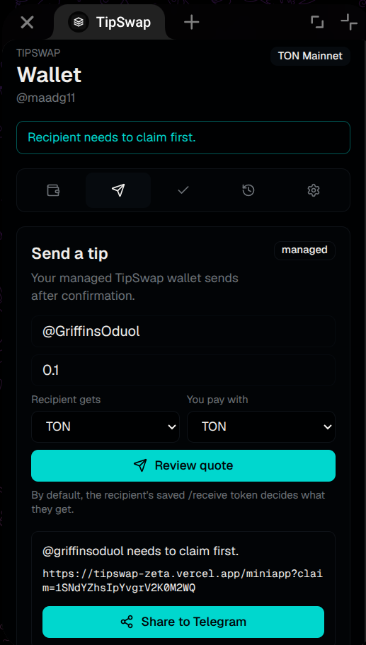
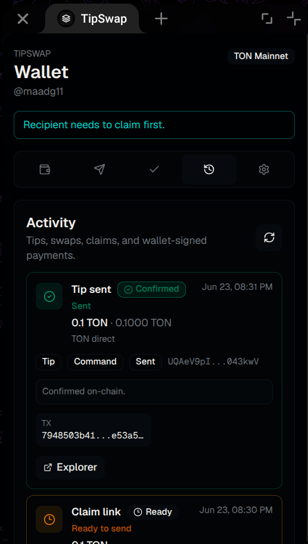
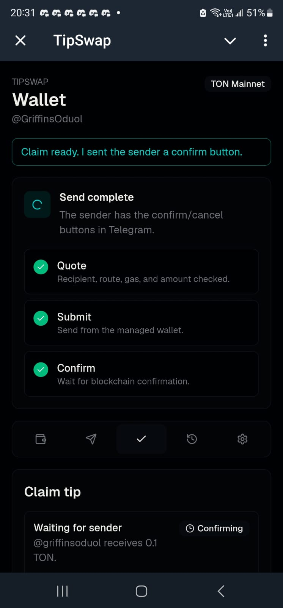
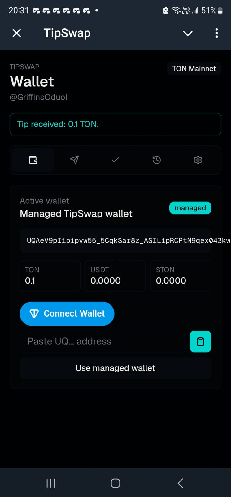
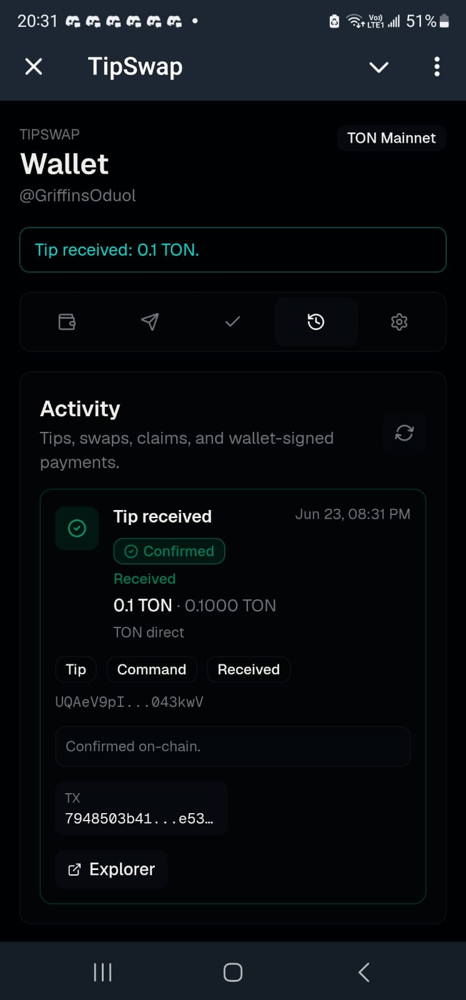
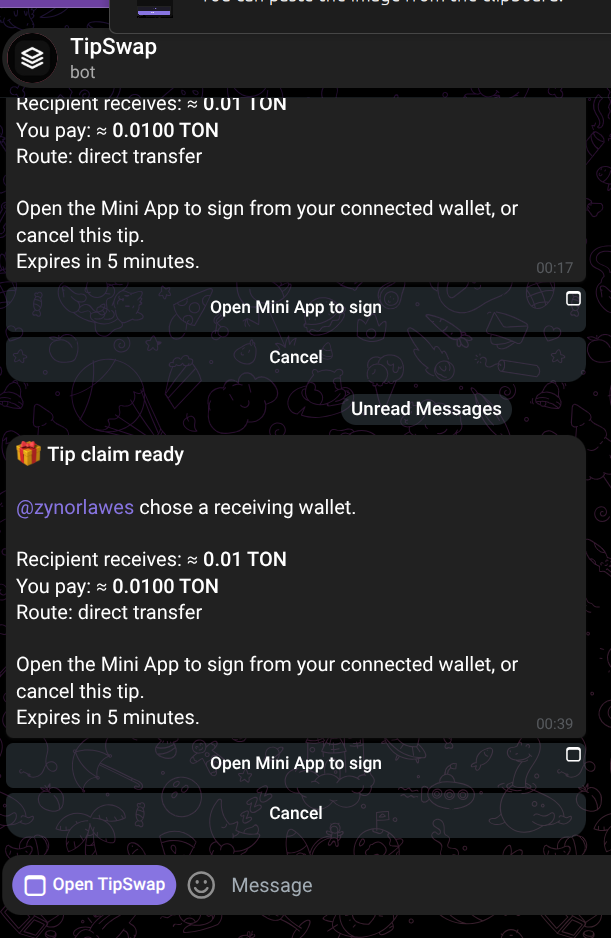
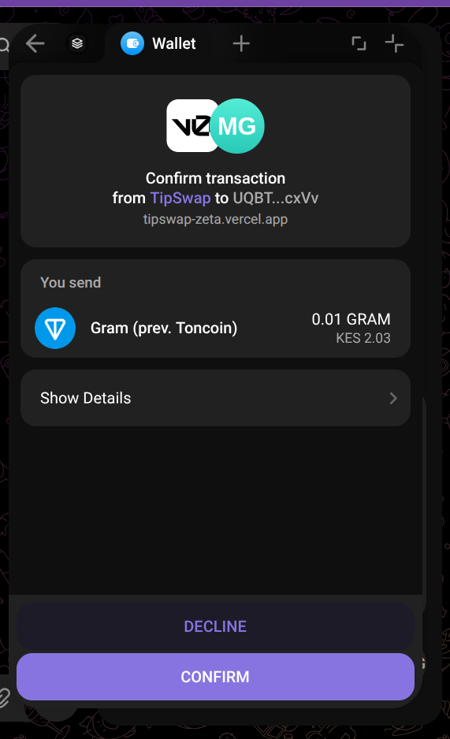
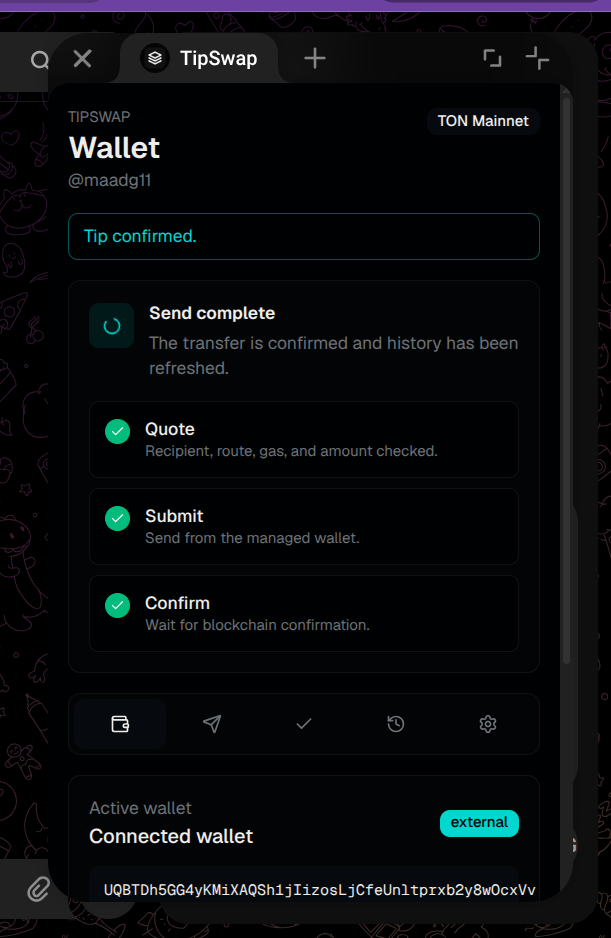

# TipSwap Flow Evidence

This document records the tested Mini App flow for a claim-link tip where the sender creates a tip for a receiver, the receiver opens the claim flow, and both sides see confirmed activity after the transaction completes.

Evidence captured on June 23, 2026.

## Flow Covered

- Sender account: `@maadg11`
- Receiver account: `@GriffinsOduol`
- Network: TON Mainnet
- Tip tested: `0.1 TON`
- Wallet mode shown in the sender flow: managed TipSwap wallet
- Final state shown in both accounts: confirmed on-chain with transaction hash and explorer link
- Transaction hash: `7948503b41167beaa8f6b8f5f5a7b69df232754b78d2947449c4c1ade53a5855`
- Explorer: <https://tonscan.org/tx/7948503b41167beaa8f6b8f5f5a7b69df232754b78d2947449c4c1ade53a5855>

## Sender Evidence

### 1. Sender Creates A Tip For A Receiver Who Needs To Claim

The sender enters the receiver username, amount, receive token, and pay token. The Mini App detects that the receiver needs to claim first and generates a claim link with a one-tap **Share to Telegram** action.



What this proves:

- The sender can start the tip from the Mini App.
- TipSwap recognizes when a receiver needs the claim-link flow.
- The Mini App creates a claim link instead of failing the send.
- The sender has a share action for delivering the claim link through Telegram.

### 2. Sender Sees Confirmed Activity After Completion

After the receiver prepares the claim and the sender confirms, the sender activity page shows the final `Tip sent` record as `Confirmed`, including a transaction hash and explorer button. The earlier claim-link record remains visible as the setup step.



Transaction:

```text
7948503b41167beaa8f6b8f5f5a7b69df232754b78d2947449c4c1ade53a5855
```

Explorer:

```text
https://tonscan.org/tx/7948503b41167beaa8f6b8f5f5a7b69df232754b78d2947449c4c1ade53a5855
```

What this proves:

- The sender gets a clear final status.
- Activity distinguishes the completed tip from the original claim-link setup item.
- The confirmed item includes on-chain evidence through the transaction hash and explorer link.

## Receiver Evidence

### 3. Receiver Opens Claim And Prepares It For Sender Confirmation

The receiver opens the Mini App claim screen. The app shows that the claim is ready and that the sender has been sent confirm/cancel buttons in Telegram.



What this proves:

- The receiver can open the claim flow from the Mini App.
- The receiver can prepare the claim using their TipSwap wallet.
- Funds do not move silently; the sender must still confirm before completion.

### 4. Receiver Wallet Updates After Sender Confirmation

After the sender confirms, the receiver home screen shows `Tip received: 0.1 TON` and the managed TipSwap wallet balance reflects the received `0.1 TON`.



What this proves:

- The receiver gets a success message after the sender confirms.
- The receiver wallet balance updates in the Mini App.
- The received token and amount match the test tip.

### 5. Receiver Activity Shows Confirmed On-Chain Result

The receiver activity page shows `Tip received` as `Confirmed`, includes the route `TON direct`, shows the receiver address, includes a transaction hash, and provides an explorer button.



Transaction:

```text
7948503b41167beaa8f6b8f5f5a7b69df232754b78d2947449c4c1ade53a5855
```

Explorer:

```text
https://tonscan.org/tx/7948503b41167beaa8f6b8f5f5a7b69df232754b78d2947449c4c1ade53a5855
```

What this proves:

- The receiver gets a persistent activity record.
- The activity page clearly shows the transaction went through.
- The record includes on-chain verification data.

## Result

The captured screens demonstrate that the claim-link tip flow works end to end:

1. Sender creates a tip for a receiver who needs to claim.
2. TipSwap generates a claim link and Telegram share action.
3. Receiver opens the claim in the Mini App and prepares it.
4. Sender confirms the prepared claim.
5. Receiver wallet balance updates.
6. Sender and receiver activity pages show confirmed on-chain status with transaction evidence.

## External Wallet Claim Flow Evidence

Evidence captured on June 25, 2026.

This section records the tested flow where the receiver chooses a wallet for a claim-link tip and the sender pays from a connected external wallet instead of a TipSwap managed wallet.

### Flow Covered

- Sender account: `@maadg11`
- Receiver account: `@zynorlawes`
- Network: TON Mainnet
- Tip tested: `0.01 TON`
- Sender wallet mode: external connected wallet
- Sender wallet: `UQBTDh5GG4yKMiXAQSh1jIizosLjCfeUnltprxb2y8wOcxVv`
- Receiver wallet: `UQBl9agug3K4QI9T0UudjmvRNl4HAXWN5rGxlwDnEIWKM_DG`
- Payment provider: TON Pay direct transfer
- TON Pay reference: `0x90f49f09968d4d6550e8091d0c54ed4df5394ce6`
- Tip id: `e7a80122-7409-4f25-8dac-b3788a64720a`
- Transaction hash: `6b454c81b57841720cee6daba2a53507efc4b342bac29b94f83f03c214920e96`
- Explorer: <https://tonscan.org/tx/6b454c81b57841720cee6daba2a53507efc4b342bac29b94f83f03c214920e96>

### 6. Sender Receives A Sign Request After Receiver Chooses A Wallet

After the receiver opens the claim link and selects a receiving wallet, the bot sends the sender a claim-ready message. The message shows the receiver, amount, route, and gives the sender an **Open Mini App to sign** action plus a cancel option.



What this proves:

- The receiver does not initiate the payment.
- The receiver prepares the claim by choosing a receiving wallet.
- The sender remains the payer and must explicitly open the Mini App to sign.
- The sender can cancel before signing.

### 7. Sender Signs From Their External Wallet

The Mini App opens the connected wallet confirmation screen. The wallet shows TipSwap as the requesting app, the sender account, the receiver address, and the `0.01 TON` transfer amount before the sender confirms.



What this proves:

- The payment is non-custodial for external-wallet senders.
- The sender reviews and signs the transfer in their own wallet.
- The transfer uses the connected wallet path instead of a managed TipSwap wallet.
- The visible amount matches the tested tip amount.

### 8. Mini App Returns To Dashboard After Payment

After the sender signs, the Mini App returns to the wallet dashboard and shows `Tip confirmed`. The active wallet is shown as `Connected wallet`, confirming that the sender used the external-wallet flow.



What this proves:

- The post-signing UX returns to the dashboard instead of leaving the sender on the signing screen.
- The Mini App confirms the successful tip state.
- The active wallet mode remains external.
- Activity can be used for persistent confirmation after the wallet signature flow.

### External Wallet Test Transactions

Main external-wallet payment:

```text
TON Pay reference: 0x90f49f09968d4d6550e8091d0c54ed4df5394ce6
Body hash: 9df594841617861bac79f3c38e91836e173c1bbec54668ce1b3c174ae86bb9d1
Trace id: f9f4adf67347cef104e1d7fd33b84b840ad588bc30be0729609960b734cd518c
Tx hash: 6b454c81b57841720cee6daba2a53507efc4b342bac29b94f83f03c214920e96
Explorer: https://tonscan.org/tx/6b454c81b57841720cee6daba2a53507efc4b342bac29b94f83f03c214920e96
```

## External Wallet Result

The captured screens demonstrate that the external-wallet claim-link flow works end to end:

1. Receiver opens the claim link and chooses a receiving wallet.
2. TipSwap notifies the sender that the claim is ready.
3. Sender opens the Mini App and signs from their connected external wallet.
4. The wallet sends the TON Pay direct transfer on-chain.
5. TipSwap records the payment and returns the sender to the dashboard.
6. The transaction can be verified on-chain using the recorded transaction hash.
